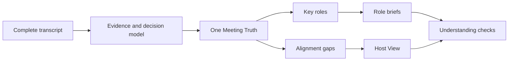

# MeetingAlign

[简体中文](README.zh-CN.md)

[](https://github.com/chiwinzhong/meeting-align/actions/workflows/validate.yml)
[](LICENSE)
[](skills/meeting-align/SKILL.md)

> **Everyone said “Got it.” Everyone meant something different.**

**MeetingAlign is an open-source, evidence-aware Agent Skill that turns a complete meeting transcript into one shared Meeting Truth, role-specific action briefs, and visible alignment gaps.**

**Meeting → Shared understanding → Role-specific action**


*Concept illustration, not a product-interface screenshot. The repository's claims are limited to the inspectable Skill, demo, and validation contracts below.*

## The problem after the meeting

Most AI meeting tools answer:

> What was said?

Execution often fails on the next question:

> What did each function think those words meant?

- “Ready” can mean testable, demoable, sellable, or publicly launched.
- “Premium” can mean visual polish, reliability, price, or service.
- A task can have an owner but no definition of done.
- A deadline can exist while the dependency that controls it has no owner.
- Everyone can say “got it” without confirming the same scope.

MeetingAlign is designed for the gap between **meeting** and **execution**.

## What it produces

### Meeting Truth

One canonical, traceable source for confirmed decisions, facts, rejected or deferred options, open questions, owners, deadlines, definitions of done, and dependencies.

### Host View

A compact control surface showing what was decided, who owns what, which gaps can break execution, and what still needs human clarification.

### Role Briefs

Each key execution role gets the same shared truth translated into six questions:

1. What matters to you?
2. What does it mean for your role?
3. What do you need to do?
4. What matters most?
5. What is the definition of done?
6. Who do you depend on?

### Alignment Gaps

MeetingAlign flags material ambiguity—vague time, quality, or completion; missing owners; missing acceptance criteria; conflicting interpretations; and hidden dependencies—without manufacturing clarity.

### Lightweight understanding checks

> My understanding: I own **X**, by **Y**, and done means **Z**.

- ✅ Aligned
- ⚠️ Needs correction

Silence remains pending.

## From transcript to shared execution



All role briefs derive from the same Meeting Truth. The Skill may translate professional implications; it may not rewrite the decision for each function.

## Inspect the method

- [Method overview](methodology/methodology.md)
- [Role translation](methodology/role-translation.md)
- [Alignment-gap model](methodology/alignment-gap.md)
- [Alignment Score limits](methodology/alignment-score.md)
- [System architecture](docs/architecture.md)

## See the complete demo

The fictional Northstar launch meeting contains vague language, scope cuts, rejected options, cross-functional dependencies, missing owners, and incomplete acceptance criteria.

1. [Raw transcript](examples/launch-meeting/transcript.md)
2. [Meeting Truth](examples/launch-meeting/meeting-truth.md)
3. [Host View](examples/launch-meeting/host-view.md)
4. [Alignment Gaps](examples/launch-meeting/alignment-gaps.md)
5. [Five Role Briefs](examples/launch-meeting/roles/)
6. [Understanding Checks](examples/launch-meeting/understanding-checks.md)
7. [Machine-readable package](examples/launch-meeting/meeting-align.json)

The example is entirely synthetic. It demonstrates the contract, not business impact.

## Quick start with Codex

```bash
git clone https://github.com/chiwinzhong/meeting-align.git
cp -R meeting-align/skills/meeting-align ~/.codex/skills/
```

Then invoke:

```text
Use $meeting-align on this complete meeting transcript. Create one Meeting Truth, a Host View, role briefs, and only the alignment gaps that can materially change execution. Do not invent missing owners, deadlines, or definitions of done.
```

The Skill follows the open Agent Skills folder structure. Other agent environments may be supported through adaptation, but this repository does not claim untested one-click compatibility.

## Validate structured output

```bash
python3 skills/meeting-align/scripts/validate_meeting_align.py \
  examples/launch-meeting/meeting-align.json

python3 skills/meeting-align/scripts/run_contract_tests.py \
  examples/launch-meeting/meeting-align.json
```

The negative tests reject:

- decisions linked to unknown evidence;
- AI suggestions promoted into meeting decisions;
- action records that hide a missing definition of done;
- silence treated as confirmation.

## What makes it different

| Approach | Primary output | Typical blind spot |
| --- | --- | --- |
| Transcript | What people said | No shared execution meaning |
| Meeting summary | What happened | Decisions, proposals, and open issues may blur |
| Action-item extractor | Tasks and owners | Scope, acceptance, and dependencies may remain implicit |
| **MeetingAlign** | Shared truth + role translation + visible gaps | Still requires human review and correction |

MeetingAlign is not a replacement for project management, legal minutes, facilitation, or management judgment. It is a controlled interpretation layer between the transcript and downstream execution.

## Alignment Score

The optional score explains clarity across decisions, ownership, deadlines, definitions of done, dependencies, and cross-role interpretation. Every deduction must be visible.

It is **not** a scientific measure of people, intelligence, culture, meeting quality, or organizational performance. Never use it for employee ranking, compensation, discipline, or surveillance.

## Privacy and authority

Meeting transcripts can contain strategy, personnel information, customer data, and confidential decisions.

- Keep data in a workflow you trust.
- Minimize copied content and access.
- Redact personal and regulated information when possible.
- Review every major decision and gap against the source.
- Do not send briefs, create tasks, notify participants, or update organizational memory without explicit authorization.
- Treat silence as pending, never approval.

See [Security and privacy](docs/security-and-privacy.md).

## Current evidence status

**Public preview · v0.2.0**

The repository currently provides:

- an inspectable Agent Skill;
- a complete synthetic end-to-end demo;
- a machine-readable contract and dependency-free validator;
- deterministic positive and negative tests;
- bilingual documentation.

It does **not** yet provide independently reviewed evidence that MeetingAlign improves delivery speed, reduces rework, or changes business outcomes. See [Evaluation protocol](docs/evaluation.md).

## Roadmap

### V0.x — Open Skill

- Meeting Truth
- role detection and briefs
- alignment gaps
- understanding checks
- explanatory score

### V1.x — Team workflow

- cross-meeting decision history
- decision-change detection
- unresolved-action tracking
- team terminology memory
- authorized collaboration integrations

### Later — Organizational Alignment Memory

A controlled memory of what the organization decided, when it changed, and where interpretation repeatedly splits.

## Why open source?

A system that interprets organizational decisions and responsibilities should be inspectable. Open source lets teams examine the rules, change them, keep data in trusted workflows, and contribute difficult edge cases.

See [Contributing](CONTRIBUTING.md).

## About

MeetingAlign is developed by **Zhiying Zhong**, an entrepreneur and AI Organizational Capability Practitioner exploring how AI turns human judgment into executable organizational capability.

Core principle:

> **Don't summarize the meeting. Align the people.**

## License

[MIT](LICENSE)
