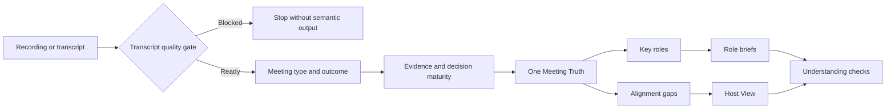

# MeetingAlign

[简体中文](README.zh-CN.md)

[](https://github.com/chiwinzhong/meeting-align/actions/workflows/validate.yml)
[](LICENSE)
[](skills/meeting-align/SKILL.md)

> **Everyone said “Got it.” Everyone meant something different.**

**MeetingAlign is an open-source, evidence-aware Agent Skill that detects what kind of meeting happened, tracks how mature each decision really is, and turns a complete recording or transcript into one shared Meeting Truth, role-specific briefs, guardrails, and visible alignment gaps.**

Raw recordings pass through a traceable transcription quality gate before interpretation. MeetingAlign never substitutes an audio summary for the complete source transcript.

**Meeting → Meaning → Maturity → Shared action**


*Concept illustration, not a product-interface screenshot. The repository's claims are limited to the inspectable Skill, demo, and validation contracts below.*

## The problem after the meeting

Most AI meeting tools answer:

> What was said?

Execution often fails on the next question:

> What did each function think those words meant?

- “Ready” can mean testable, demoable, sellable, or publicly launched.
- “Premium” can mean visual polish, reliability, price, or service.
- A task can have an owner but no definition of done.
- A deadline can exist while the dependency that controls it has no owner.
- Everyone can say “got it” without confirming the same scope.

MeetingAlign is designed for the gap between **meeting** and **execution**—without pretending that every strategy, discovery, or brainstorming meeting should already look execution-ready.

## What it produces

### Meeting Type & Outcome

The Skill distinguishes strategy, decision, kickoff, execution, review, sales, discovery, and brainstorming meetings before judging the output. It records the expected standard and whether the meeting is exploring, setting direction, execution-ready, in execution, or reviewing.

### Decision Maturity

Important statements stay at the highest evidence-supported level: `IDEA`, `HYPOTHESIS`, `DIRECTIONAL_CONSENSUS`, `CONFIRMED_DECISION`, or `COMMITTED_ACTION`. Enthusiasm and silence do not create commitment.

### Meeting Truth

One canonical, traceable source for confirmed decisions, facts, rejected or deferred options, open questions, owners, deadlines, definitions of done, and dependencies.

### Host View

A compact control surface showing what was decided, who owns what, which gaps can break execution, and what still needs human clarification.

### Role Briefs

Each key execution role gets the same shared truth translated into six questions:

1. What matters to you?
2. What does it mean for your role?
3. What do you need to do?
4. What matters most?
5. What is the definition of done?
6. Who do you depend on?

Each brief can also carry an evidence-based **Don't / Guardrail** so execution boundaries travel with the task.

### Alignment Gaps

MeetingAlign flags material ambiguity—vague time, quality, or completion; missing owners; missing acceptance criteria; conflicting interpretations; hidden dependencies; maturity mismatch; and readiness mismatch—without manufacturing clarity.

### Lightweight understanding checks

> My understanding: I own **X**, by **Y**, and done means **Z**.

- ✅ Aligned
- ⚠️ Needs correction

Silence remains pending.

## Audio-safe ingestion

MeetingAlign does not claim to contain its own speech-recognition engine. For raw audio or video, it uses a reliable transcription capability available in the authorized runtime, preserves timestamps and speaker turns, and enters semantic analysis only after complete transcript coverage is available.

If reliable transcription is unavailable, it returns `INGESTION_BLOCKED` and produces no decisions, actions, role briefs, or Alignment Gaps. It never guesses speaker identity from voice alone.

## From recording to shared execution



All role briefs derive from the same Meeting Truth. The Skill may translate professional implications; it may not rewrite the decision for each function.

## Inspect the method

- [Method overview](methodology/methodology.md)
- [Role translation](methodology/role-translation.md)
- [Alignment-gap model](methodology/alignment-gap.md)
- [Alignment Score limits](methodology/alignment-score.md)
- [Audio-ingestion contract](skills/meeting-align/references/audio-ingestion.md)
- [Meeting type and outcome](skills/meeting-align/references/meeting-type-and-outcome.md)
- [Decision maturity](skills/meeting-align/references/decision-maturity.md)
- [Strategic open questions](skills/meeting-align/references/strategic-open-questions.md)
- [Role guardrails](skills/meeting-align/references/role-guardrails.md)
- [System architecture](docs/architecture.md)

## See the complete demo

The fictional Northstar launch meeting contains vague language, scope cuts, rejected options, cross-functional dependencies, missing owners, and incomplete acceptance criteria.

1. [Raw transcript](examples/launch-meeting/transcript.md)
2. [Meeting Type](examples/launch-meeting/meeting-type.md)
3. [Meeting Truth](examples/launch-meeting/meeting-truth.md)
4. [Host View](examples/launch-meeting/host-view.md)
5. [Alignment Gaps](examples/launch-meeting/alignment-gaps.md)
6. [Five Role Briefs](examples/launch-meeting/roles/)
7. [Understanding Checks](examples/launch-meeting/understanding-checks.md)
8. [Machine-readable package](examples/launch-meeting/meeting-align.json)

The example is entirely synthetic. It demonstrates the contract, not business impact.

## Quick start with Codex

```bash
git clone https://github.com/chiwinzhong/meeting-align.git
cp -R meeting-align/skills/meeting-align ~/.codex/skills/
```

Then invoke:

```text
Use $meeting-align on this complete meeting recording or transcript. If it is a recording, pass the transcription quality gate first. Classify the meeting type and decision maturity, then create one Meeting Truth, a Host View, role briefs with evidence-based guardrails, and only the gaps that can materially change direction or execution. Do not invent transcript coverage, speaker identity, commitment, owners, deadlines, or definitions of done.
```

The Skill follows the open Agent Skills folder structure. Other agent environments may be supported through adaptation, but this repository does not claim untested one-click compatibility.

## Validate structured output

```bash
python3 skills/meeting-align/scripts/validate_meeting_align.py \
  examples/launch-meeting/meeting-align.json

python3 skills/meeting-align/scripts/run_contract_tests.py \
  examples/launch-meeting/meeting-align.json

python3 tools/run_adversarial_contracts.py \
  tests/adversarial-contracts.json
```

The negative tests reject:

- decisions linked to unknown evidence;
- semantic decisions produced from a blocked recording;
- partial recording coverage presented as complete;
- AI suggestions promoted into meeting decisions;
- rejected work promoted into an action;
- action records that hide a missing definition of done;
- a strategy meeting forced into a kickoff-style action list;
- directional consensus promoted into a confirmed decision;
- unsupported role guardrails or the wrong score profile;
- silence treated as confirmation.

The T00–T15 suite contains 16 deterministic synthetic golden contracts. It is a contract baseline, not evidence that every model or runtime will generate the expected result.

## What makes it different

| Approach | Primary output | Typical blind spot |
| --- | --- | --- |
| Transcript | What people said | No shared execution meaning |
| Meeting summary | What happened | Decisions, proposals, and open issues may blur |
| Action-item extractor | Tasks and owners | Scope, acceptance, and dependencies may remain implicit |
| **MeetingAlign** | Meeting semantics + shared truth + role translation + visible gaps | Still requires human review and correction |

MeetingAlign is not a replacement for project management, legal minutes, facilitation, or management judgment. It is a controlled interpretation layer between the transcript and downstream execution.

## Alignment Score

The optional score uses a declared meeting-type profile. Strategy work emphasizes direction, boundaries, maturity visibility, open questions, and next validation; kickoff and execution emphasize ownership, timing, definitions of done, dependencies, and handoffs. When useful, **Execution Readiness** is shown separately. Every deduction must be visible.

It is **not** a scientific measure of people, intelligence, culture, meeting quality, or organizational performance. Never use it for employee ranking, compensation, discipline, or surveillance.

## Privacy and authority

Meeting transcripts can contain strategy, personnel information, customer data, and confidential decisions.

- Confirm authority to record, transcribe, retain, and process the source in the selected environment.
- Keep data in a workflow you trust.
- Minimize copied content and access.
- Redact personal and regulated information when possible.
- Review every major decision and gap against the source.
- Use neutral speaker labels when identity cannot be mapped reliably; never identify people from voice alone.
- Do not send briefs, create tasks, notify participants, or update organizational memory without explicit authorization.
- Treat silence as pending, never approval.

See [Security and privacy](docs/security-and-privacy.md).

## Current evidence status

**Public preview · v0.4.0 — Meeting Semantics**

The repository currently provides:

- an inspectable Agent Skill;
- a complete synthetic end-to-end demo;
- a runtime-independent recording-ingestion boundary and quality gate;
- meeting-type detection, decision-maturity mapping, and outcome-state contracts;
- strategic open questions, role guardrails, and maturity/readiness gaps;
- a machine-readable contract and dependency-free validator;
- deterministic positive and negative tests, including sixteen synthetic adversarial contracts;
- bilingual documentation.

It does **not** contain a built-in speech-recognition engine, and it does **not** yet provide independently reviewed evidence that MeetingAlign improves delivery speed, reduces rework, or changes business outcomes. See [Evaluation protocol](docs/evaluation.md).

## Roadmap

### V0.x — Open Skill

- Meeting Truth
- audio-safe ingestion gate
- role detection and briefs
- meeting type, decision maturity, and outcome state
- strategic open questions and evidence-based role guardrails
- alignment gaps
- understanding checks
- explanatory score
- T00–T15 adversarial contracts

### V1.x — Team workflow

- cross-meeting decision history
- decision-change detection
- unresolved-action tracking
- team terminology memory
- authorized collaboration integrations

### Later — Organizational Alignment Memory

A controlled memory of what the organization decided, when it changed, and where interpretation repeatedly splits.

## Why open source?

A system that interprets organizational decisions and responsibilities should be inspectable. Open source lets teams examine the rules, change them, keep data in trusted workflows, and contribute difficult edge cases.

See [Contributing](CONTRIBUTING.md).

## About

MeetingAlign is developed by **Zhiying Zhong**, an entrepreneur and AI Organizational Capability Practitioner exploring how AI turns human judgment into executable organizational capability.

Core principle:

> **Don't summarize the meeting. Align the people.**

## License

[MIT](LICENSE)
