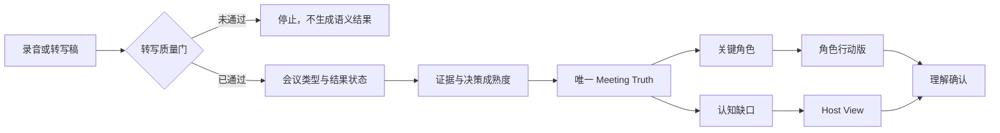

# MeetingAlign

[English](README.md)

[](https://github.com/chiwinzhong/meeting-align/actions/workflows/validate.yml)
[](LICENSE)
[](skills/meeting-align/SKILL.md)

> **所有人都说“明白”。问题是，每个人明白的都不一样。**

**MeetingAlign 是一个开源、证据感知的 Agent Skill：先识别发生了什么类型的会议、每项决定究竟成熟到哪一步，再把完整录音或转写稿转化为唯一会议事实、岗位说明、行动护栏和可见的认知缺口。**

原始录音必须先通过可追溯的转写质量门，MeetingAlign 不会用一份音频摘要冒充完整会议证据。

**会议 → 含义 → 成熟度 → 共同执行**


*这是概念插画，不是产品界面截图。仓库只主张下方可检查的 Skill、Demo 和验证合同。*

## 真正的问题发生在会后

多数 AI 会议工具回答的是：

> 会议说了什么？

执行失败往往发生在下一问：

> 不同岗位分别认为这些话是什么意思？

- “月底 ready”可能分别被理解为能测试、能演示、能销售或能公开发布；
- “要有品牌感”可能意味着视觉、可靠性、价格或服务；
- 任务有负责人，但没有做到什么才算完成；
- 截止日期明确，但真正控制日期的依赖没有负责人；
- 所有人都说“明白”，却没有确认同一个范围。

MeetingAlign 专门处理**会议与执行之间的认知断层**，同时不会把战略共创、需求探索或头脑风暴强行包装成已经可以开工的任务清单。

## 它会输出什么

### Meeting Type & Outcome｜会议类型与结果状态

先区分战略、决策、项目启动、执行、复盘、销售、探索或头脑风暴会议，再判断它应该达到什么输出标准，以及当前处于探索、方向已定、执行就绪、执行中还是复盘状态。

### Decision Maturity｜决策成熟度

重要表述只停留在证据支持的最高层级：`IDEA`、`HYPOTHESIS`、`DIRECTIONAL_CONSENSUS`、`CONFIRMED_DECISION` 或 `COMMITTED_ACTION`。热情、重复和沉默都不能制造承诺。

### Meeting Truth｜会议事实母版

唯一、可追溯的事实源：已确认决策、会议事实、否决或延后事项、未决问题、负责人、截止日期、验收标准和依赖关系。

### Host View｜主持人全局版

不是普通纪要，而是会后控制面：决定了什么、谁负责什么、哪些缺口会让执行跑偏、哪些问题仍需人工澄清。

### Role Briefs｜角色行动版

每个关键执行角色都基于同一份 Meeting Truth 回答六个问题：

1. 什么与你有关？
2. 这对你的岗位意味着什么？
3. 你要做什么？
4. 什么最重要？
5. 做到什么算完成？
6. 你依赖谁？

每份角色说明还可以带上有证据支持的 **Don't / Guardrail｜不要做什么**，让执行边界随任务一起传递。

### Alignment Gaps｜认知缺口

识别会改变方向或执行结果的模糊点：时间、质量、完成状态、缺失负责人、缺失验收标准、相互冲突的理解、隐藏依赖、成熟度错位与就绪度错位，同时拒绝用 AI 自行补造清晰度。

### 极轻理解确认

> 我的理解：我负责 **X**，在 **Y** 前完成，完成标准是 **Z**。

- ✅ 理解一致
- ⚠️ 有一处需要纠正

没有回复就保持待确认，不把沉默当作同意。

## 音频安全输入

MeetingAlign 不宣称内置语音识别引擎。遇到原始音频或视频时，它调用已获授权运行环境中可靠的转写能力，保留时间戳和发言轮次，并且只在完整转写覆盖可用后进入语义分析。

如果无法获得可靠转写，它会返回 `INGESTION_BLOCKED`，不生成决策、任务、角色说明或认知缺口，也不会仅凭声音猜测发言人身份。

## 从录音到共同执行



所有角色说明都从同一个会议事实母版派生。可以翻译岗位含义，但不能为不同部门重写不同版本的决策。

## 检查方法论

- [方法总览](methodology/methodology.md)
- [角色翻译](methodology/role-translation.md)
- [认知缺口模型](methodology/alignment-gap.md)
- [Alignment Score 边界](methodology/alignment-score.md)
- [音频输入合同](skills/meeting-align/references/audio-ingestion.md)
- [会议类型与结果状态](skills/meeting-align/references/meeting-type-and-outcome.md)
- [决策成熟度](skills/meeting-align/references/decision-maturity.md)
- [战略未决问题](skills/meeting-align/references/strategic-open-questions.md)
- [岗位行动护栏](skills/meeting-align/references/role-guardrails.md)
- [系统架构](docs/architecture.md)

## 直接看完整 Demo

虚构的 Northstar 产品试点会议包含真实会议常见的模糊语言、范围删减、被否决方案、跨部门依赖、缺失负责人和不完整验收标准。

1. [原始转写稿](examples/launch-meeting/transcript.md)
2. [Meeting Type](examples/launch-meeting/meeting-type.md)
3. [Meeting Truth](examples/launch-meeting/meeting-truth.md)
4. [Host View](examples/launch-meeting/host-view.md)
5. [Alignment Gaps](examples/launch-meeting/alignment-gaps.md)
6. [五份 Role Brief](examples/launch-meeting/roles/)
7. [理解确认](examples/launch-meeting/understanding-checks.md)
8. [机器可读结果](examples/launch-meeting/meeting-align.json)

整个案例完全虚构，只证明运行合同，不代表业务效果。

## 在 Codex 中安装

```bash
git clone https://github.com/chiwinzhong/meeting-align.git
cp -R meeting-align/skills/meeting-align ~/.codex/skills/
```

调用示例：

```text
使用 $meeting-align 处理这份完整会议录音或转写稿。若输入是录音，先通过转写质量门。识别会议类型和决策成熟度，再输出唯一 Meeting Truth、Host View、带证据护栏的角色行动版，以及真正可能改变方向或执行结果的认知缺口。不得补造转写覆盖、发言人身份、承诺、负责人、截止日期或验收标准。
```

本 Skill 遵循开放 Agent Skills 目录结构。其他 Agent 环境可以适配，但本仓库不宣称未经测试的一键兼容。

## 验证结构化结果

```bash
python3 skills/meeting-align/scripts/validate_meeting_align.py \
  examples/launch-meeting/meeting-align.json

python3 skills/meeting-align/scripts/run_contract_tests.py \
  examples/launch-meeting/meeting-align.json

python3 tools/run_adversarial_contracts.py \
  tests/adversarial-contracts.json
```

负例测试会拦截：

- 决策引用不存在的证据；
- 在录音转写被阻断后仍然生成语义决策；
- 把不完整录音覆盖表述成完整转写；
- 把 AI 建议升级为会议决策；
- 把已否决工作升级为行动；
- 用完整表述掩盖“没有验收标准”；
- 把战略会议强行转换为启动会任务清单；
- 把方向共识升级为确认决策；
- 生成无证据的岗位护栏或选择错误评分模型；
- 把沉默当作理解一致。

T00–T15 包含 16 项确定性的虚构黄金合同。它是合同基线，不代表所有模型或运行环境都会自动生成预期结果。

## 与普通会议工具的区别

| 方式 | 主要输出 | 常见盲区 |
| --- | --- | --- |
| 转写工具 | 大家说了什么 | 没有共同执行含义 |
| 会议纪要 | 会议发生了什么 | 讨论、提议、决策和未决问题可能混在一起 |
| 任务提取 | 任务与负责人 | 范围、验收和依赖仍然隐含 |
| **MeetingAlign** | 会议语义＋共同事实＋岗位翻译＋可见缺口 | 仍然必须由人复核和纠正 |

MeetingAlign 不替代项目管理、法律纪要、专业主持或管理判断。它是会议记录与下游执行之间的受控解释层。

## Alignment Score

可选评分必须声明会议类型模型。战略会议强调方向、边界、成熟度可见性、未决问题与下一步验证；启动和执行会议强调负责人、时间、完成标准、依赖与交接。必要时将 **Execution Readiness｜执行就绪度** 单独呈现。每一项扣分都必须可见。

它**不是**对人、智力、文化、会议质量或组织绩效的科学测量。不得用于员工排名、薪酬、纪律或监控。

## 隐私与权限

会议记录可能包含战略、人事、客户和敏感决策：

- 确认有权在所选环境中录音、转写、保存和处理源文件；
- 只在可信工作流中处理；
- 最小化复制内容和访问范围；
- 尽可能脱敏个人及受监管信息；
- 所有重要决策和缺口必须回到原始记录核验；
- 发言人身份无法可靠对应时使用中性标签，不通过声音识别人；
- 未经明确授权，不发送角色说明、不创建任务、不通知参与者、不写入组织长期记忆；
- 沉默永远保持待确认。

详见[安全与隐私](docs/security-and-privacy.md)。

## 当前证据状态

**公开预览 · v0.4.0 — Meeting Semantics**

当前仓库包括：

- 可检查的 Agent Skill；
- 完整虚构端到端 Demo；
- 不绑定转写供应商的录音输入边界与质量门；
- 会议类型识别、决策成熟度和结果状态合同；
- 战略未决问题、岗位行动护栏和成熟度／就绪度错位；
- 机器可读合同与零依赖验证器；
- 可复现的正向和负向测试，包括十六项虚构对抗合同；
- 中英文文档。

当前版本**不包含内置语音识别引擎**，也**没有**独立验证证据证明 MeetingAlign 能提高交付速度、降低返工或改变业务结果。详见[评价协议](docs/evaluation.md)。

## Roadmap

### V0.x｜开放 Skill

- 会议事实母版
- 音频安全输入质量门
- 角色识别与行动版
- 会议类型、决策成熟度与结果状态
- 战略未决问题与证据型岗位护栏
- 认知缺口
- 理解确认
- 解释型评分
- T00–T15 对抗合同

### V1.x｜团队工作流

- 跨会议决策历史
- 决策变更识别
- 未完成事项追踪
- 团队术语记忆
- 经授权的协作工具集成

### Later｜Organizational Alignment Memory

受控地记住组织曾决定什么、何时发生改变，以及认知断层反复出现在哪里。

## 为什么开源

一个解释组织决策和责任的系统应该允许检查。开源让团队能查看规则、修改规则、把数据留在可信工作流中，并贡献真实难例。

详见[参与贡献](CONTRIBUTING.md)。

## 关于作者

MeetingAlign 由 **Zhiying Zhong** 开发。他是一名创业者和 AI Organizational Capability Practitioner，持续探索AI如何把人的判断转化为可执行的组织能力。

核心原则：

> **不要只总结会议，要让人真正对齐。**

## License

[MIT](LICENSE)
