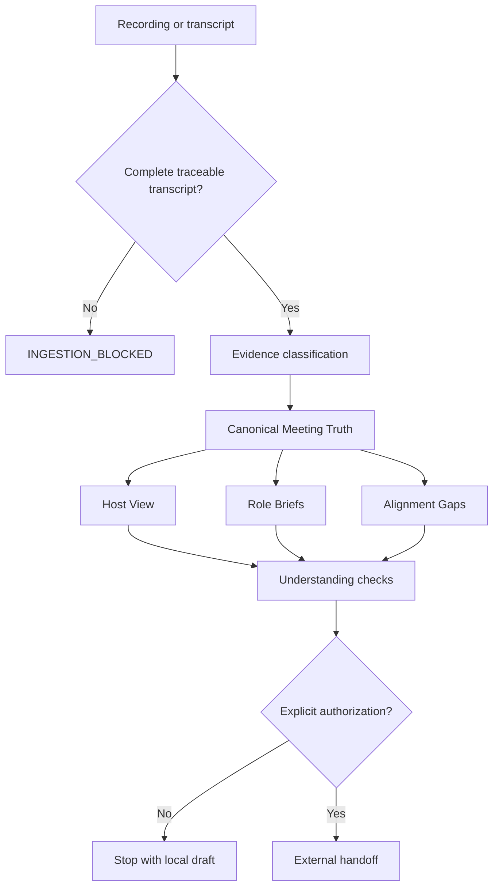

# Architecture

MeetingAlign is packaged as an inspectable Agent Skill, not as a hosted meeting bot. One authorized source becomes one governed truth package, then role-specific views are derived from it. A recording must first become a complete, traceable transcript through a host-provided adapter.

## Components

- `SKILL.md` defines the operating workflow and authority boundary.
- `references/` contains evidence classification, role translation, gap detection, and output rules.
- `audio-ingestion.md` defines the recording adapter boundary and transcript quality gate.
- `meeting-align.schema.json` defines the machine-readable package.
- `validate_meeting_align.py` checks cross-reference and completeness invariants without third-party dependencies.
- `run_contract_tests.py` verifies that known failure modes are rejected.
- `tests/adversarial-contracts.json` and its runner encode T00–T10 as synthetic golden contracts.
- `examples/launch-meeting/` provides a synthetic end-to-end fixture.

## Design invariants

1. **One truth, many views.** Every role brief derives from the same canonical Meeting Truth.
2. **Evidence before interpretation.** Decisions and facts require source pointers; inferences and AI suggestions remain explicitly labeled.
3. **Missing stays missing.** The system does not invent owners, deadlines, scope, dependencies, or definitions of done.
4. **Silence is pending.** Understanding is confirmed only by an explicit response.
5. **External action is gated.** Sending briefs, creating tasks, or writing organizational memory requires separate authorization.
6. **No transcript, no semantic truth.** A blocked or partial recording cannot produce meeting-wide decisions or actions.

## Trust boundary

The open package performs no network calls and contains no service credentials or speech-recognition engine. An agent environment may add transcription, storage, or collaboration integrations, but those integrations are outside this repository's trusted core and must preserve its evidence, privacy, and authorization rules.
