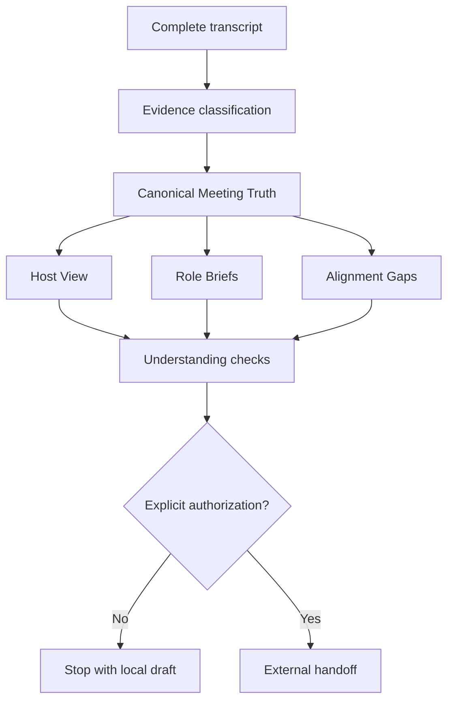

# Architecture

MeetingAlign is packaged as an inspectable Agent Skill, not as a hosted meeting bot. Its first public version is deliberately small: one source record becomes one governed truth package, then role-specific views are derived from it.

## Components

- `SKILL.md` defines the operating workflow and authority boundary.
- `references/` contains evidence classification, role translation, gap detection, and output rules.
- `meeting-align.schema.json` defines the machine-readable package.
- `validate_meeting_align.py` checks cross-reference and completeness invariants without third-party dependencies.
- `run_contract_tests.py` verifies that known failure modes are rejected.
- `examples/launch-meeting/` provides a synthetic end-to-end fixture.

## Design invariants

1. **One truth, many views.** Every role brief derives from the same canonical Meeting Truth.
2. **Evidence before interpretation.** Decisions and facts require source pointers; inferences and AI suggestions remain explicitly labeled.
3. **Missing stays missing.** The system does not invent owners, deadlines, scope, dependencies, or definitions of done.
4. **Silence is pending.** Understanding is confirmed only by an explicit response.
5. **External action is gated.** Sending briefs, creating tasks, or writing organizational memory requires separate authorization.

## Trust boundary

The open package performs no network calls and contains no service credentials. An agent environment may add transcription, storage, or collaboration integrations, but those integrations are outside this repository's trusted core and must preserve its evidence and authorization rules.
